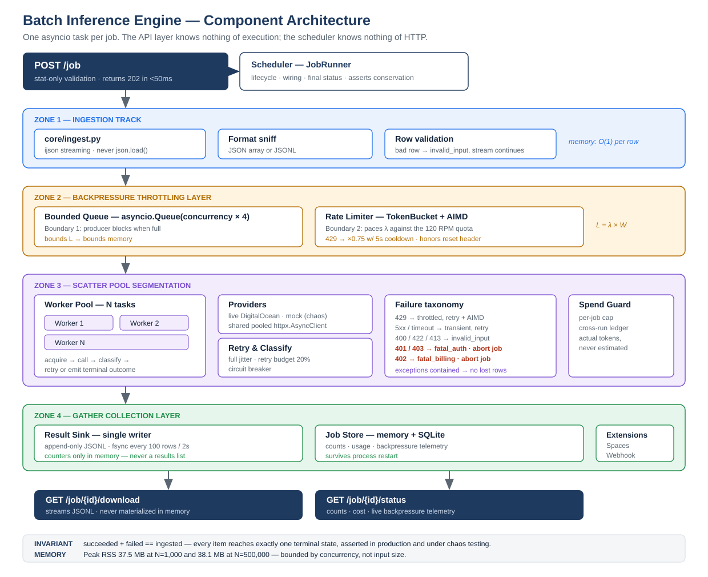

# Batch Inference Engine

**For a design review, start with [`docs/design.md`](docs/design.md)** —
the canonical architecture and design document (specification, design
goals, full component-by-component design, cross-cutting concerns,
scale thresholds). This README is the quickstart and a summary; `design.md`
is the primary artifact.

## 1. What this is

A REST API service that fans a batch of prompts out to DigitalOcean
Serverless Inference (or a deterministic mock) through a bounded worker
pool, staying within the account's rate quota and using O(concurrency)
memory regardless of batch size. It tracks flow control, memory, and
failure semantics as first-class, tested concerns — not as afterthoughts
around "call an LLM API in a loop."

## 2. Quickstart

Zero credentials required — the service automatically uses a deterministic
mock provider when `DO_INFERENCE_KEY` is unset.

```bash
git clone <this repo> && cd do-batch-inference-engine
pip install -e ".[dev]"
python scripts/generate_batch.py --n 1000          # writes data/sample_batch.json
uvicorn batchengine.main:app --port 8000 &

curl -s -X POST localhost:8000/job \
  -H "Content-Type: application/json" \
  -d '{"input_path": "data/sample_batch.json", "concurrency": 8}'
# {"job_id": "01J...", "status": "queued", "submitted_at": "..."}

curl -s localhost:8000/job/<job_id>/status | python -m json.tool
curl -s localhost:8000/job/<job_id>/download   # NDJSON, streamed
```

### Live mode

```bash
cp .env.example .env
# fill in DO_INFERENCE_KEY (see §14 of instructions.md for how to get one)
uvicorn batchengine.main:app --port 8000
```

With a key present, `POST /job` automatically uses the live DigitalOcean
provider instead of the mock — and automatically caps ingestion at
`LIVE_SAMPLE_SIZE` (50) unless raised, and always at `MAX_LIVE_ITEMS` (1000)
as a hard ceiling; see "Product findings" and `docs/decisions.md`. **One
full 1,000-item live run has been recorded** — see
[`docs/sample_run.json`](docs/sample_run.json) and results.md; the §6.8
over-rate throttling experiment is recorded in
[`docs/observed_throttling.md`](docs/observed_throttling.md).

## 3. Architecture



> The Mermaid-rendered diagrams under `docs/diagrams/*.mmd` render
> correctly on GitHub but not in most other viewers (LibreOffice, Word,
> generic SVG rasterizers) — their styling lives in a `<style>` block with
> CSS class selectors that those renderers ignore, turning every shape
> into a solid black box. `architecture.svg`, `job-lifecycle.svg`, and
> `item-path.svg` are hand-authored with explicit presentation attributes
> instead, so they're the portable versions; the Mermaid sources (and
> their GitHub-rendered `.svg` output) remain as the editable source of
> truth.

Four zones — ingestion, backpressure throttling, scatter pool, gather
collection — walked in detail in [`docs/design.md`](docs/design.md), the
canonical architecture document. In short: `ijson` streams the input row
by row into a bounded `asyncio.Queue`, a TokenBucket+AIMD controller paces
request rate against the account quota independent of worker count, N
workers classify and retry against the §6.2 failure taxonomy, and a
single writer appends results to JSONL while keeping only counters in
memory. `docs/design.md` also includes a job-lifecycle state diagram, an
end-to-end single-item sequence diagram, an explicit "Delivery semantics"
section (at-least-once, not exactly-once — read this before assuming what
happens on a crash), and a "Non-goals" section.

## 4. Project structure

```
do-batch-inference-engine/
├── src/batchengine/
│   ├── main.py                    App factory + lifespan (shared httpx client, SQLite store)
│   ├── app_state.py                Process-wide state container (split out to avoid an import cycle)
│   ├── config.py                   pydantic-settings: every env var, one place
│   ├── api/
│   │   ├── routes.py                POST /job, GET status/download, cancel, /healthz, /metrics
│   │   └── schemas.py               Pydantic request/response models for the §5 contract
│   ├── core/
│   │   ├── models.py                Dependency-free domain types: PromptItem, RowResult/RowError,
│   │   │                            FailureClass taxonomy, JobRecord
│   │   ├── ingest.py                Streaming JSON/JSONL reader (ijson); never json.load()
│   │   ├── scheduler.py             JobRunner: wires ingest → queue → limiter → workers → sink
│   │   ├── worker.py                Per-item acquire → call → classify → retry-or-emit loop
│   │   ├── ratelimit.py             TokenBucket (mechanism) + AIMD AdaptiveController (policy)
│   │   ├── retry.py                 Failure classification table, full jitter, retry budget,
│   │   │                            circuit breaker
│   │   ├── sink.py                  Single-writer append-only JSONL, batched fsync, replay()
│   │   └── spend_ledger.py          Cross-run committed spend cap (the outer guard; see §6.7)
│   ├── providers/
│   │   ├── base.py                  InferenceProvider Protocol + ProviderResponse/TransportError
│   │   ├── digitalocean.py          Live provider; MODEL_PRICING; null-content malformed handling
│   │   └── mock.py                  Seeded chaos provider — the entire test suite's foundation
│   ├── store/
│   │   ├── base.py                  JobStore Protocol
│   │   ├── memory.py                In-memory store (used by tests and scripts/memory_probe.py)
│   │   └── sqlite.py                SQLite-backed store (used by the running app)
│   ├── observability/
│   │   ├── logging.py                structlog JSON configuration
│   │   └── metrics.py                Hand-rolled Prometheus text exposition
│   └── extensions/
│       ├── webhook.py                HMAC-signed completion webhook, SSRF-guarded
│       └── spaces.py                 DigitalOcean Spaces multipart checkpointing (feature-flagged)
├── tests/
│   ├── conftest.py                  Shared fixtures: app_client_factory, write_batch, wait_for_terminal
│   ├── unit/                        One file per src module, fakes/respx only — no network
│   ├── integration/                 Full app via httpx.ASGITransport; test_conservation.py is
│   │                                the crown jewel (§0's invariant, under 10 chaos configs)
│   └── property/                    hypothesis: conservation and rate-limit bounds under
│                                     randomized inputs, not just fixed cases
├── scripts/
│   ├── generate_batch.py            Builds an N-item sample batch file
│   ├── memory_probe.py              Measures RSS at N=1K/10K/100K/500K against the mock provider
│   └── cost_table.py                 Computes the README's cost table from MODEL_PRICING
├── docs/
│   ├── design.md                    Canonical architecture & design document (start here)
│   ├── architecture.md              Superseded — one-line pointer to design.md
│   ├── decisions.md                 ADR log: every choice, its rejected alternative, and why
│   ├── scaling.md                   Measured memory table + throughput/Little's-Law analysis
│   ├── model-selection.md           Why the spec's model is unavailable; live catalog findings
│   ├── observed_throttling.md       §6.8: the deliberate over-rate live experiment
│   ├── sample_run.json              The one full 1,000-item live run, recorded verbatim
│   ├── memory_probe_results.json    Raw output backing docs/scaling.md's measured table
│   └── diagrams/                    Mermaid sources (.mmd) + rendered .svg; hand-authored
│                                     *.svg (architecture, job-lifecycle, item-path) are the
│                                     portable versions — see §3 above
├── results.md                       Evidence index: every claim, with what proves it
├── BUILD_LOG.md, STATUS.md,         The morning-review packet (instructions.md §12.3)
│   OPEN_QUESTIONS.md
├── instructions.md                  The original build spec, committed verbatim (shows process)
├── .github/workflows/ci.yml         ruff, mypy --strict, pytest+coverage, docker build — no secrets
└── Dockerfile, docker-compose.yml, Makefile
```

## 5. Design decisions

Full writeups (each naming the rejected alternative) are in
[`docs/decisions.md`](docs/decisions.md). Summary:

- **Per-item dispatch through a shared queue, not static chunk
  partitioning** — the project statement's literal wording asks for
  chunking; a shared queue is self-balancing against straggler prompts
  where static chunks are not, at the cost of chunk-level checkpointing
  granularity. See "Non-goals" and "Delivery semantics" in
  [`docs/design.md`](docs/design.md) for what this system does
  and doesn't guarantee as a result.
- **Token bucket, not just a semaphore** — a semaphore bounds concurrency;
  it says nothing about request *rate*, which is what the account quota
  actually limits.
- **Full jitter, not plain exponential backoff** — plain exponential keeps
  a retry cohort synchronized on every wave; full jitter decorrelates it
  starting on the first retry.
- **AIMD cooldown window** — without it, a burst of concurrent 429s
  collapses the rate multiplicatively (`0.75^N`) instead of backing off
  once.
- **Bounded queue as the memory boundary** — ingestion can never run more
  than `concurrency×4` rows ahead of processing, which is the whole
  O(concurrency) memory story.
- **JSONL sink, not an in-memory results list** — completed work is durable
  and streamable without ever holding the full result set twice.

## 6. Failure taxonomy

| Condition | Class | Action |
|---|---|---|
| 200 | `success` | record result |
| 429 | `throttled` | retry; AIMD down; honor reset header; attempt cap 8 |
| 408, 500, 502, 503, 504 | `transient` | retry, full jitter, max 5 attempts |
| timeout / connect error | `transient` | retry |
| 400, 422 | `invalid_input` | **terminal** — record row error, never retry |
| 413 / context-length exceeded | `invalid_input` | **terminal** |
| 401, 403 | `fatal_auth` | **abort entire job** — fail fast |
| 402 | `fatal_billing` | **abort entire job** — prepaid balance exhausted |
| malformed/unparseable response | `transient` | retry once, then terminal |

Implemented as `FailureClass` in `core/models.py`; classified by
`core/retry.py::classify()`; table-driven-tested in
`tests/unit/test_classify.py`.

**The invariant this whole system is built to preserve:**
`succeeded_count + failed_count == items_ingested`, always — see
`tests/integration/test_conservation.py` (fixed chaos configs) and
`tests/property/test_conservation_property.py` (hypothesis-generated chaos
mixes).

## 7. Scaling and memory

Full analysis in [`docs/scaling.md`](docs/scaling.md). Headlines:

- Peak RSS is **flat from N=1,000 to N=500,000** (measured — see the table
  in `docs/scaling.md`, regenerated by `python scripts/memory_probe.py`).
- The account's 120 RPM quota, not this engine, is the throughput
  bottleneck: 1,000 prompts has a hard floor of ~8.3 minutes, and 500,000
  would take ~69 hours on Tier 1 — a product decision (Batch Inference /
  Dedicated Inference / quota increase), not a code problem. See the
  decision table in `docs/scaling.md` §"When to stop using this service."
- Correct concurrency sizing comes from Little's Law (`L = λ×W`), tracked
  live and exposed as `littles_law_optimal_concurrency` in
  `GET /job/{id}/status`.

## 8. Product findings

Verified against DigitalOcean's live documentation, control panel, and
(2026-09-16) the live model-access-key endpoint itself — see
[`docs/model-selection.md`](docs/model-selection.md) for the full record:

- **The project statement's model, `meta-llama-3-8b-instruct`, is not
  available on Serverless Inference** — DigitalOcean's catalog lists
  `llama3-8b-instruct` as dedicated-inference-only.
- **The cheapest-on-paper serverless option, `openai-gpt-oss-20b`, turned
  out not to be usable at this service's default `max_tokens=128`.** It's
  a reasoning model: queried live, it returns `content: null` with the
  entire token budget spent on a `reasoning_content` field instead. This
  service now defaults to `mistral-3-14B` — the cheapest model that
  returns actual usable content at this budget — and treats non-string
  `content` as a malformed response rather than passing `None` through as
  a false success (`providers/digitalocean.py`, tested in
  `tests/unit/test_digitalocean_provider.py::test_complete_marks_null_content_as_malformed`).
  The model remains fully configurable via `BATCHENGINE_MODEL` / the
  `model` request field, including back to `openai-gpt-oss-20b` if a
  caller raises `max_tokens` enough to leave room for real content after
  reasoning.
- **Serverless inference is prepaid; HTTP 402 means the balance hit $0.**
  This is a fatal, whole-job failure class (`fatal_billing`), not a
  per-row retryable one — see the failure taxonomy above and
  `core/spend_ledger.py`.
- **`x-ratelimit-reset-requests` is a forward-refill projection shared by
  every caller on the account, not a fixed window boundary.** Waking every
  worker at exactly that timestamp would recreate the exact throttle it
  just paused for; this service adds per-worker jitter on resume
  (`core/ratelimit.py::AdaptiveController.honor_reset_header`).

### Cost model (§1.1/§9)

Computed by `python scripts/cost_table.py` (reads pricing from
`providers/digitalocean.py::MODEL_PRICING` — never hand-typed):

assuming ~150 input / ~200 output tokens per prompt

| Model ID | $/1M input | $/1M output | Est. cost, 1,000 prompts | Est. cost, 500,000 prompts |
|---|---|---|---|---|
| `mistral-3-14B` (default) | $0.2 | $0.2 | ~$0.07 | ~$35.00 |
| `openai-gpt-oss-120b` | $0.06 | $0.39 | ~$0.09 | ~$43.50 |
| `openai-gpt-oss-20b` | $0.05 | $0.45 | ~$0.10 | ~$48.75 |
| `gemma-4-31B-it` | $0.18 | $0.5 | ~$0.13 | ~$63.50 |
| `llama-4-maverick` | $0.2 | $0.696 | ~$0.17 | ~$84.60 |

Note that `openai-gpt-oss-20b`'s table position (second-cheapest on paper)
is exactly why it's worth naming the model-selection finding above out
loud: on-paper pricing and usable-output cost aren't always the same
ranking.

## 9. When to stop using this service

See the full decision table in [`docs/scaling.md`](docs/scaling.md). In
short: this engine is right for up to low tens-of-thousands of items on
serverless inference; beyond that, DigitalOcean Batch Inference (separate
quota pool, up to 50% discount), a Dedicated Inference endpoint (removes
the shared RPM ceiling), or a quota tier increase are each the correct next
step depending on latency sensitivity and sustained volume — not a more
clever scheduler.

## 10. Testing

```bash
make test          # pytest, 85% coverage gate, zero network / zero credentials
make lint           # ruff check + format --check
make typecheck       # mypy --strict
```

- **Unit** (`tests/unit/`): rate limiter refill/AIMD/cooldown math, retry
  classification (table-driven over the full taxonomy), full-jitter bounds,
  retry budget, circuit breaker state machine, streaming ingest (array +
  JSONL + malformed rows), sink append/flush/replay.
- **Integration** (`tests/integration/`): full app via
  `httpx.ASGITransport` against the mock provider — job lifecycle,
  conservation under 7 fixed chaos configurations, 429 backpressure and
  rate convergence, mixed partial failure, fatal-abort-within-a-handful-of-
  requests, graceful cancellation with no orphaned tasks, streamed
  download.
- **Property** (`tests/property/`, `hypothesis`): conservation holds across
  randomized chaos-parameter combinations; the token bucket never exceeds
  its configured rate over any sliding window, for randomized rate/
  capacity/request-pattern combinations.

Every live-provider code path (`providers/digitalocean.py`) is implemented
but excluded from CI by construction: `DO_INFERENCE_KEY` is never set in
the test environment, so `POST /job` always selects the mock provider (see
`api/routes.py`). No test, fixture, or CI step ever sets that variable.

## 11. What I'd do with more time

- Wire DigitalOcean Spaces checkpointing (`extensions/spaces.py`) into a
  real bucket and add a `moto`-backed integration test — implemented but
  untested against anything but the interface it presents.
- Close the two honestly-marked test-coverage gaps in `results.md` §1 (N4):
  the per-job spend guard's trip-and-abort path and the pre-flight
  ledger-exhausted `402` refusal. Both are structurally unreachable in a
  zero-credential suite (they only run when `is_live=True`), so covering
  them means injecting a fake live provider rather than relaxing N5 —
  worth doing, but not at the cost of the zero-credential guarantee.
- Revisit `AdaptiveController.max_rate = rate_rps × 1.5` now that the
  1,000-item live run has shown what it costs: 11 avoidable 429s
  re-discovering a limit the operator already configured (see
  `docs/decisions.md`). The one-line `max_rate = rate_rps` fix was left
  unmade deliberately; with a known-exact quota it is probably the right
  default, with the 1.5× headroom becoming opt-in for unknown quotas.
- Replace the download endpoint's synchronous per-line file read with true
  async file I/O (`aiofiles` or a thread executor) — currently a known,
  documented simplification (see `OPEN_QUESTIONS.md`) that blocks the event
  loop briefly per chunk on very large downloads.
- Dynamic worker-pool resizing (today, concurrency is fixed for a job's
  lifetime; only the token bucket's rate adapts). Right-sizing the pool
  itself mid-run against the live Little's-Law estimate would tighten the
  gap between "configured" and "optimal" concurrency shown in
  `GET /job/{id}/status`.
