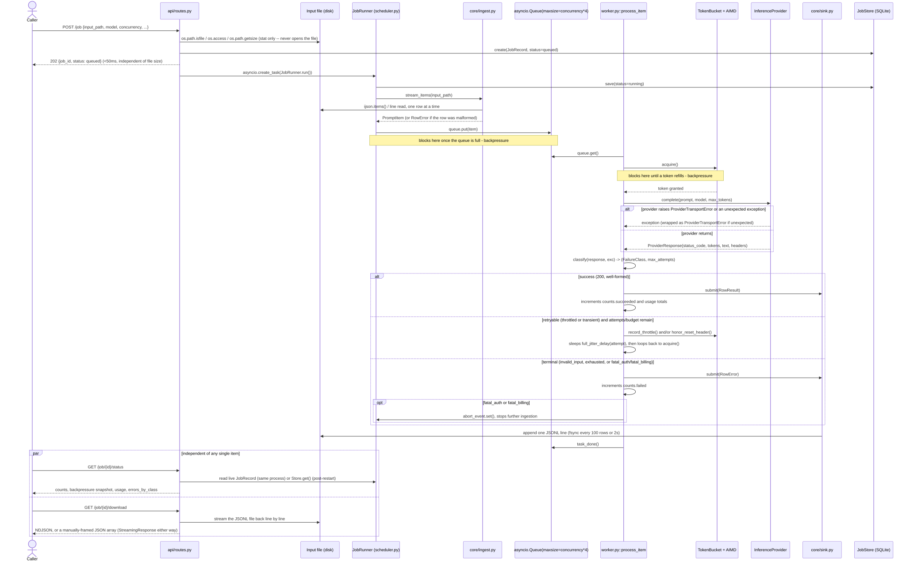

# Architecture

One asyncio task per job (spawned from `POST /job`, never awaited on the
request path) walks four zones:

## Zone 1 — Ingestion track

`core/ingest.py` streams the input file row by row with `ijson.items()`
(JSON array) or a line reader (JSONL, auto-sniffed from the first
non-whitespace byte). `json.load()` never appears in this codebase. A
malformed row is recorded as an `invalid_input` error and the stream
continues — one corrupt row must not kill an otherwise-healthy job.

`POST /job` itself does *stat-only* validation (existence, readability,
size) and returns in under 50ms regardless of file size, because it never
opens the file for parsing — see `tests/integration/test_job_lifecycle.py::test_submit_returns_202_under_50ms`.

## Zone 2 — Backpressure throttling layer

Two independent mechanisms, doing two different jobs:

1. **`asyncio.Queue(maxsize=concurrency×4)`** bounds how far ingestion can
   run ahead of processing. This is what bounds memory — see §6.6 / `docs/scaling.md`.
2. **TokenBucket + AIMD `AdaptiveController`** (`core/ratelimit.py`) paces
   *request rate*, independent of worker count. A semaphore alone bounds
   concurrency, not rate — see `docs/decisions.md`.

## Zone 3 — Scatter pool segmentation

N worker tasks (`core/worker.py`) each: acquire a token from the bucket,
call the provider through one shared, pooled `httpx.AsyncClient`, classify
the outcome (`core/retry.py`, the §6.2 taxonomy), and either emit a terminal
result or retry with full-jitter backoff. A circuit breaker trips if >50% of
the last window's requests are failing; a global retry budget caps total
retries at 20% of the job so a struggling upstream is never
retry-amplified. `fatal_auth`/`fatal_billing` set an abort flag that stops
ingestion and drains in-flight work within a handful of requests, not after
the whole batch is burned.

**Dispatch model:** every item flows through one shared `asyncio.Queue`
consumed by the fixed worker pool, rather than the input being partitioned
into N static chunks with one chunk per worker. This is a deliberate
deviation from the project statement's literal wording ("partition the
1,000 prompt records into concurrent execution chunks") -- see
`docs/decisions.md`'s "Per-item dispatch through a shared queue vs. static
chunk partitioning" for the full tradeoff, including what static chunking
would have bought (simpler per-chunk checkpointing and retry granularity)
and why straggler imbalance made it the wrong default here.

A worker that has an unexpected exception raised from the provider call
(anything not already modeled as `ProviderTransportError` or a classified
HTTP response) does not let that exception kill the worker task -- it's
caught, logged, and converted into a retryable transient failure, with a
second, outer safety net in `worker_loop` that emits a terminal `RowError`
if anything still escapes. This is what keeps the conservation invariant
(`succeeded + failed == ingested`) true even against a provider bug, not
just against the failure modes this codebase already knows how to name --
see `tests/integration/test_conservation.py`'s `p_unexpected_exception`
case.

## Zone 4 — Gather collection layer

A single writer task (`core/sink.py`) appends every terminal outcome to a
JSONL file, batching `fsync` every 100 rows or 2 seconds. Only counters are
kept in memory — never a results list. `JobStore` (in-memory, mirrored to
SQLite) tracks status/counts/rates/cost so `GET /job/{id}/status` and
`GET /job/{id}/download` can serve a job whether it's live in this process
or reloaded after a restart.

## Why this shape

The three things graded most heavily (§0) map directly onto the four zones:
flow control lives in zones 2–3, memory boundedness is the combined effect
of the queue cap (zone 2) and the JSONL sink (zone 4), and failure semantics
is entirely zone 3's classify/retry/circuit-breaker/abort logic.

## Job lifecycle

`queued -> running -> {succeeded, partial, failed, cancelled}`. Two things
worth reading off the diagram directly rather than assuming:

- **There is no separate "aborted" status.** `fatal_auth`, `fatal_billing`,
  and the spend guard all set the same internal `abort_event`; every path
  through it resolves to the ordinary `failed` status. The distinguishing
  information lives in `JobRecord.abort_reason`, not in `status` -- a
  caller polling only `status` cannot tell an abort apart from "every item
  happened to fail on its own." This is deliberate (§0's failure taxonomy
  is about the *rows*, not the job-level status enum) but worth being able
  to say out loud.
- **Durability is periodic, not per-item, while a job is running.**
  `JobRecord` is persisted to SQLite on creation, at the queued->running
  transition, every 25 ingested items, and once at the terminal
  transition -- not on every single item. The live `GET /job/{id}/status`
  read path is unaffected by this (it reads the same in-memory object the
  scheduler mutates, while the process is up); it only matters for what a
  *restarted* process would see. See "Delivery semantics" below.

## One item, end to end

Traces a single prompt from `POST /job` through stat validation, the 202
response, streaming ingest, the bounded queue, token acquisition,
classification, retry-or-emit, the sink, and back out through
`status`/`download`. The two explicit backpressure points (queue-full,
bucket-empty) are exactly the two mechanisms described in Zone 2 above,
shown at the granularity of one item instead of the whole pipeline.

## Delivery semantics

**This system is at-least-once, not exactly-once, and not even
consistently at-least-once across a process restart.** Concretely, as the
code exists today:

- **While the process is alive**, every ingested item is guaranteed to
  reach a terminal outcome exactly once: `process_item` either returns
  after emitting a `RowResult`/`RowError`, or (per the Zone 3 note above)
  an exception is caught and converted into one. This is what the
  conservation invariant actually certifies, and it's the case the test
  suite is built around.
- **If the process dies mid-job**, every item that was in flight (already
  dequeued, mid-retry-backoff, or sitting in the bounded queue waiting for
  a worker) is simply lost from memory -- there is no persisted record of
  "this specific item was dispatched but its outcome is unknown." The
  JSONL sink only contains rows that *reached* a terminal outcome and were
  flushed before the crash (fsync batches every 100 rows or 2 seconds, so
  a handful of already-completed rows can also be lost if the crash lands
  inside that window).
- **On restart, nothing currently re-drives an interrupted job
  automatically.** `core/sink.py::replay()` exists and can rebuild counts
  and the set of already-seen item ids from an existing JSONL file, but no
  code path in this build calls it to resume a job's *ingestion* from
  where it left off -- there is no "resubmit job X, skip what's already in
  its result file" endpoint or startup hook wired up. A restarted job, if
  resubmitted, re-reads the input file from the start and re-dispatches
  every item, including ones that already succeeded and were already
  billed. **This means a crash-and-resubmit on a live provider re-pays for
  every item that had already completed** -- there is no dedup against the
  existing result file today.
- **What exactly-once would require:** before dispatching an item, durably
  record "item X is in flight" (not just "item X completed"); on restart,
  reconcile that in-flight set against the JSONL result file and only
  re-dispatch items with no recorded outcome; and make the provider call
  itself idempotent or dedupe on the provider side (an LLM completion call
  is not naturally idempotent -- calling it twice for the same prompt does
  not return the same answer, so "exactly-once delivery" of the request
  and "exactly-once effect" are different guarantees, and this system
  provides neither across a restart today).

## Non-goals

- **Single-process.** There is no distributed coordination -- one process
  owns the in-memory queue, worker pool, and rate limiter for every job it
  runs. Scaling beyond one process's throughput would require moving the
  queue and job state to something shared (Redis, a real message broker, a
  distributed lock over the token bucket), which is a materially different
  system, not a configuration change to this one.
- **No authentication.** Every endpoint is open to anyone who can reach the
  process. Adding it would mean a real identity/authorization layer in
  front of `api/routes.py`, plus deciding what a "job" is scoped to (a
  user? an API key? a team?) -- currently a job belongs to the process, not
  to anyone.
- **No multi-tenancy.** Jobs share one process's rate limiter, worker
  pool, and spend ledger with no isolation between "tenants" -- one
  caller's job can exhaust the shared rate budget or the cross-run spend
  ledger for everyone else. Real multi-tenancy would need per-tenant quota
  accounting, which the current single global `TokenBucket` and
  `.spend_ledger.json` don't provide.
- **No priority or fairness between concurrently running jobs.** Each
  job gets its own `JobRunner`, worker pool, and token bucket sized off
  the *same* account-wide RPM setting -- two jobs running at once each
  assume they have the full quota to themselves and will jointly exceed
  it. There is no scheduler-level arbitration deciding whose requests get
  the next token when multiple jobs are competing for the same real
  account quota.
- **No exactly-once delivery.** Covered in detail above -- included here
  too because it's a property someone reviewing this system should expect
  to have to ask about, not discover by reading code.
